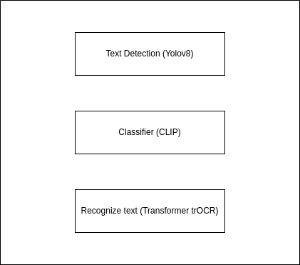
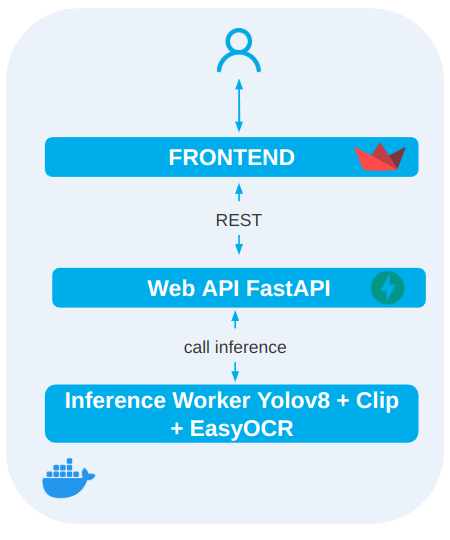
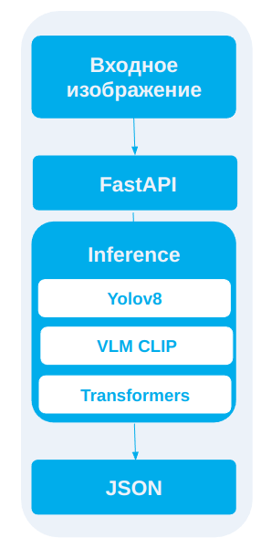

# OCR для рукописных банковских документов

  

## 🎯 Обзор

Система автоматического распознавания текста (OCR) для банковских документов с фокусом на рукописный ввод. Позволяет:

- Детектировать текстовые блоки (YOLOv8).
- Классифицировать блоки как рукописные или печатные (CLIP).
- Распознавать кириллический текст внутри bbox (TrOCR).
- Генерировать выход в формате JSON с координатами и текстом.
- Интерактивно тестировать через Streamlit UI или запускать через FastAPI.


## 🚀 Ключевые возможности

- **Детекция текста**: YOLOv8, fine-tuned на рукописи, F1≈92.7%, latency≈100 ms.
- **Распознавание**: TrOCR (`raxtemur/trocr-base-ru`), дообучение на банковских анкетах.
- **Классификация**: CLIP-model для разделения рукописного и печатного текста.
- **Интерактивный интерфейс**: Streamlit приложение для быстрой демонстрации.
- **API**: FastAPI эндпоинт `/ocr` для интеграции в существующие системы.
- **Контейнеризация**: готовый Dockerfile и `docker-compose`.


## 📦 Установка

1. Клонировать репозиторий:
   ```bash
   git clone https://github.com/your_org/ocr-bank-docs.git
   cd ocr-bank-docs
   ```
2. Создать виртуальное окружение и установить зависимости:
   ```bash
   python3 -m venv .venv
   source .venv/bin/activate
   pip install -r requirements.txt
   ```
3. (Опционально) Установить в editable-режиме:
   ```bash
   pip install -e .
   ```


## 🚀 Быстрый старт

### Локальный запуск API

```bash
uvicorn src.ocr_bank_docs.api:app --host 0.0.0.0 --port 8000
```

**Пример запроса:**
```bash
curl -X POST "http://localhost:8000/ocr" \   
     -F "image=@/path/to/image.jpg" | jq
```

### Streamlit UI

```bash
streamlit run src/ocr_bank_docs/ui/app.py
```


## 🐳 Docker

1. Собрать образ:
   ```bash
   docker build -t ocr-bank-docs:latest .
   ```
2. Запустить контейнер:
   ```bash
   docker run --rm -p 8000:8000 ocr-bank-docs:latest
   ```


## ⚙️ Пайплайн

1. **Detection**: `src/ocr_bank_docs/detection/inference.py`
2. **Classification**: те же bbox → CLIP фильтр ручного/печатного.
3. **Recognition**: `src/ocr_bank_docs/pipelines/run_pipeline.py` (TrOCR).
4. **Output**: JSON вида:
   ```json
   {
     "bbox": {"x": 50.0, "y": 80.0, "width": 250.0, "height": 40.0},
     "text": "Пример"
   }
   ```


## 📊 Бенчмаркинг и оценка качества

- **Скрипт запуска**: `scripts/benchmark.py` — меряет время и среднюю latency.
- **Метрики**: WER и CER считаются через `scripts/evaluate.py`.
- **Рекомендации**: стартовый набор — 10–20 сканов, замеры latency ≤ 1 s на документ.


## 🗂️ Структура проекта

```
ocr-bank-docs/
├── src/
│   └── ocr_bank_docs/
│       ├── api/         # FastAPI endpoints
│       ├── detection/   # YOLO-инференс и классификация
│       ├── pipelines/   # Основной pipeline run_pipeline.py
│       └── ui/          # Streamlit приложение
├── scripts/
│   ├── benchmark.py
│   └── evaluate.py
├── test_datasets/       # Примерные сканы для тестирования
├── requirements.txt
├── Dockerfile
├── docker-compose.yml
└── README.md
```


## 🏗️ Архитектура системы


Система состоит из следующих ключевых компонентов:

FastAPI – REST API для приёма изображений и выдачи JSON-ответов.

Streamlit UI – веб-интерфейс для визуализации результата и отладки.

Detection Module – YOLOv8, fine-tuned на рукописных образцах, обнаруживает текстовые блоки и их координаты.

Classification Module – CLIP-модель разделяет рукописный и печатный текст внутри bbox.

Recognition Module – TrOCR (raxtemur/trocr-base-ru), дообученный на банковских анкетах, распознаёт текст.

Orchestration – единый pipeline (run_pipeline.py) объединяет все шаги, управляет очередью задач и выполняет постобработку.





## ⚙️ Пайплайн

⚙️ Описание пайплайна


Загрузка изображения

Пользователь отправляет файл через API или загружает его в Streamlit UI.


Detection

YOLOv8 находит все текстовые блоки и возвращает bbox (x, y, width, height).

Classification

Для каждого bbox CLIP-классификатор определяет, рукописный это текст или печатный.

Recognition

Вырезка ROI по bbox и передача в TrOCR. Полученный текст и его уверенность сохраняются.

Output

Формирование JSON-ответа в формате:




## 📚 Данные и дообучение

Используемые датасеты:

- [Russian Handwritten Letters (Kaggle)](https://www.kaggle.com/datasets/olgabelitskaya/handwritten-russian-letters)
- [Cyrillic Handwriting (Kaggle)](https://www.kaggle.com/datasets/constantinwerner/cyrillic-handwriting-dataset)
- [HWR200 (Hugging Face)](https://huggingface.co/datasets/AntiplagiatCompany/HWR200)
- [Russian Handwritten Text(for detection)](https://universe.roboflow.com/max-kuznetsov/russian-handwritten-text)
