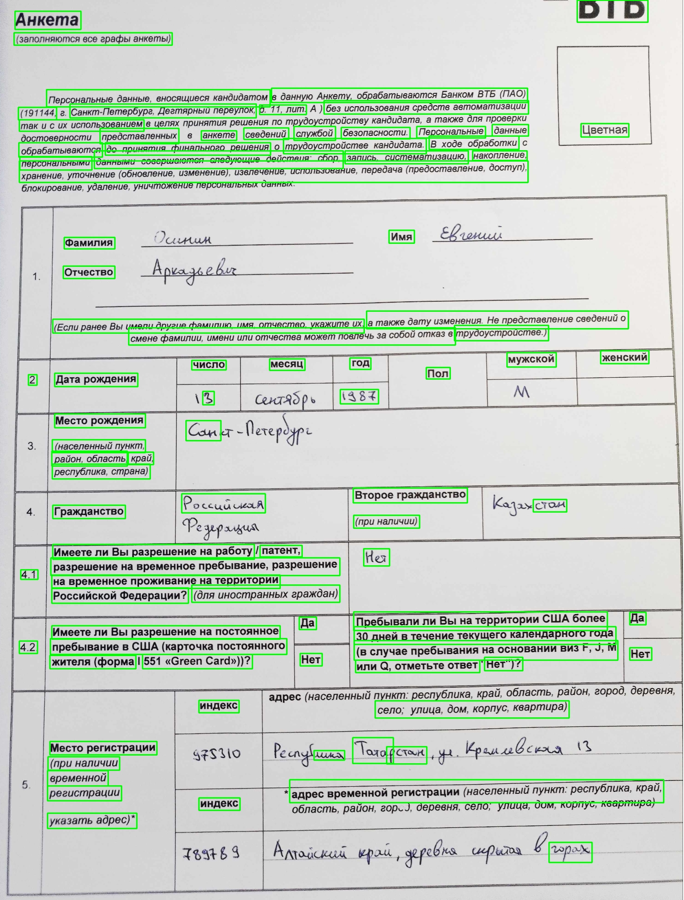
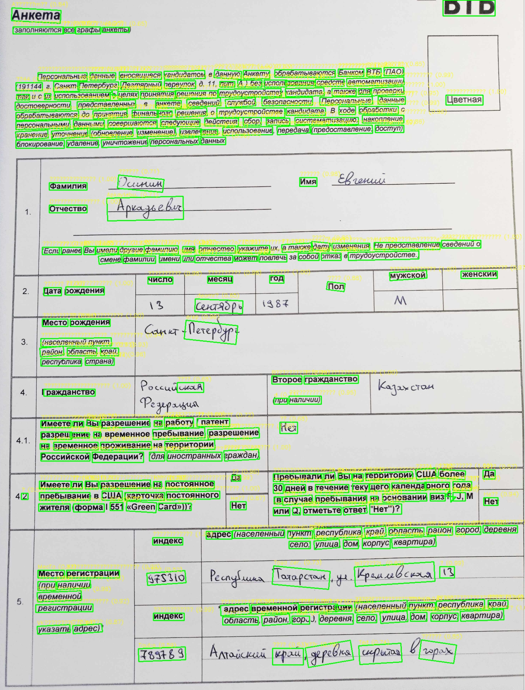
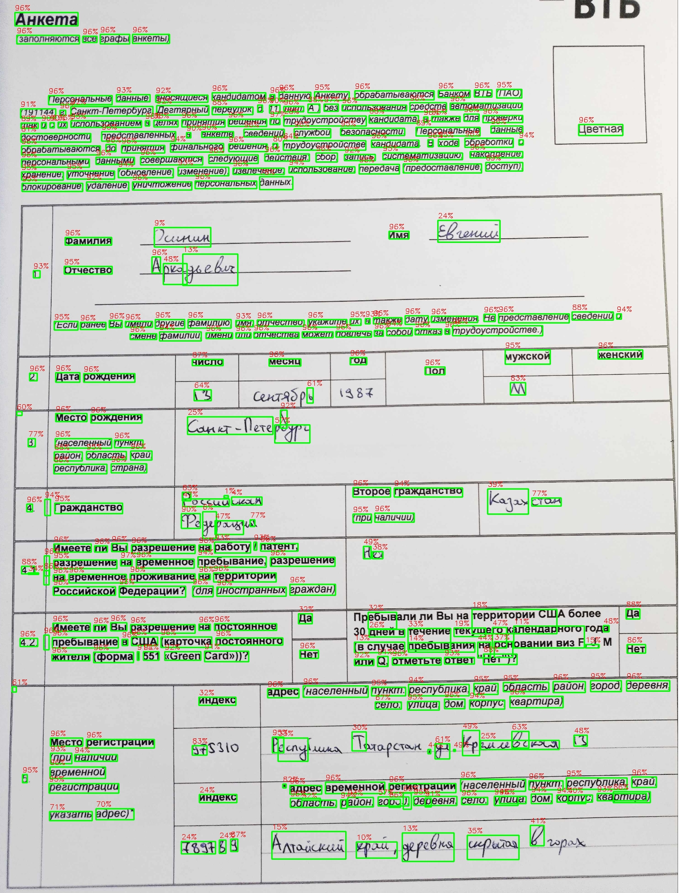
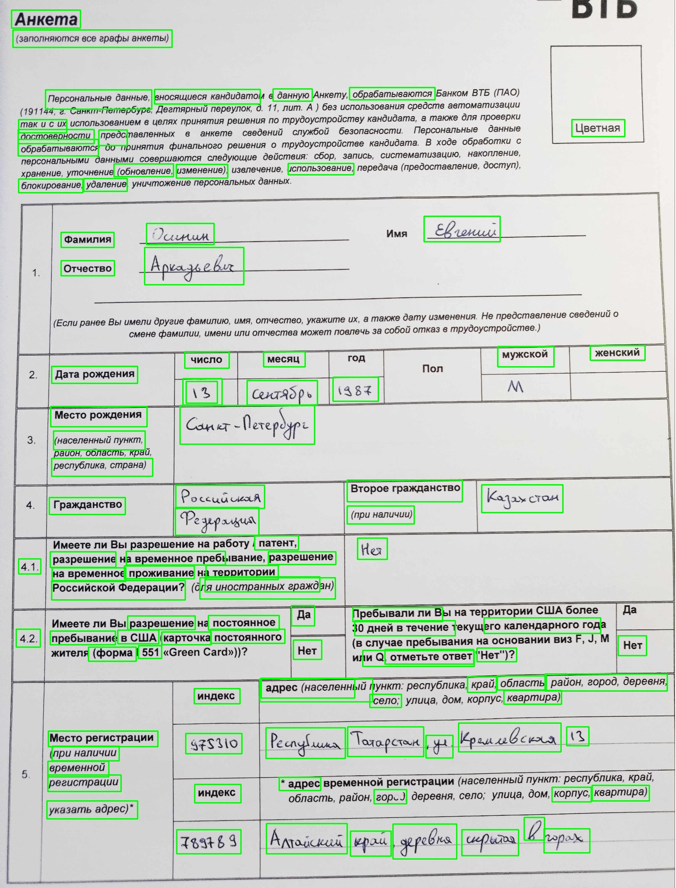

# Ресерч-док

## 1. Пример данных

Пример выходного JSON после обработки одного изображения:  
```json
[
  {
    "bbox": {"x": 512.0, "y": 341.25, "width": 1024.0, "height": 136.5},
    "text": "некоторый распознанный текст"
  },
  {
    "bbox": {"x": 512.0, "y": 341.25, "width": 1024.0, "height": 136.5},
    "text": "еще текст"
  }
]
```

## 2. Обзор датасетов

**Handwritten Russian Letters**  
• ~145 000 изображений отдельных букв с аннотациями bbox + лейбл  
• Используется для генерации слов и дообучения на кириллице

**Cyrillic Handwriting Dataset**  
• Реальные рукописные слова/фразы на кириллице  
• Разнообразные стили, шумы, искажения

**HWR 200**  
• Банковские анкеты с заполненными полями  
• Аннотации ключевых полей: даты, должности, организации

## 3. Метрики

- **CER** (Character Error Rate)  
- **WER** (Word Error Rate)

## 4. Выбор детектора

Опираясь на **таймлайн команды** (День 3: тренировка YOLOv8, День 4: оценка моделей)  


Провели микро-исследование по детекции текстовых блоков:

| Метод                         | F1 (рукописные) | F1 (печатные) | Время инференса (ms) |
|-------------------------------|-----------------|---------------|----------------------|
| EasyOCR                       | 82.4%           | 94.1%         | 350                  |
| PaddleOCR                     | 78.3%           | 97.0%         | 400                  |
| Tesseract                     | 65.2%           | 99.2%         | 250                  |
| **YOLOv8 (fine-tuned)**       | **92.7%**       | **98.8%**     | **100**              |

Примеры предсказаний (bbox):  
 
  
  


## 5. Модуль классификации

Для автоматического определения типа документа и контекста полей сравнили подходы:

| Метод                          | Точность | Время инференса (ms) |
|--------------------------------|----------|----------------------|
| ResNet50 CNN                   | 88.5%    | 50                   |
| SVM + HOG                      | 75.2%    | 30                   |
| **CLIP (Vision–Language Model)**| **94.3%**| 120                  |

**Выбор CLIP**: zero-shot способности и качественные векторные представления для разных макетов.

## 6. Выбор модели распознавания текста

Исследовали три архитектуры для распознавания внутри bbox:

| Модель                     | CER    | WER    | Комментарии                                            |
|----------------------------|--------|--------|--------------------------------------------------------|
| CRNN + CTC                 | 12.5%  | 24.3%  | Базовый подход, слабее при шумах и искажениях          |
| **TrOCR (Microsoft)**      | **8.2%** | **15.7%** | Предобучена на документах, легко дообучается на кириллице |
| ViT + CTC                  | 10.1%  | 18.9%  | Высокая вычислительная нагрузка                         |

**Выбор TrOCR** обусловлен наименьшими CER/WER и поддержкой тонкого дообучения на наших банковских данных.
