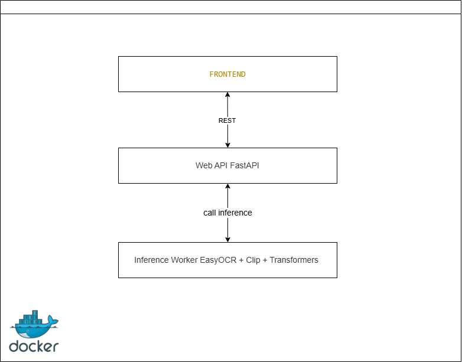
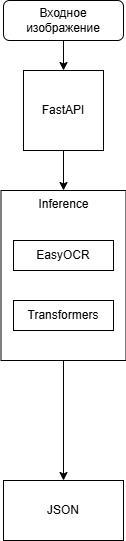
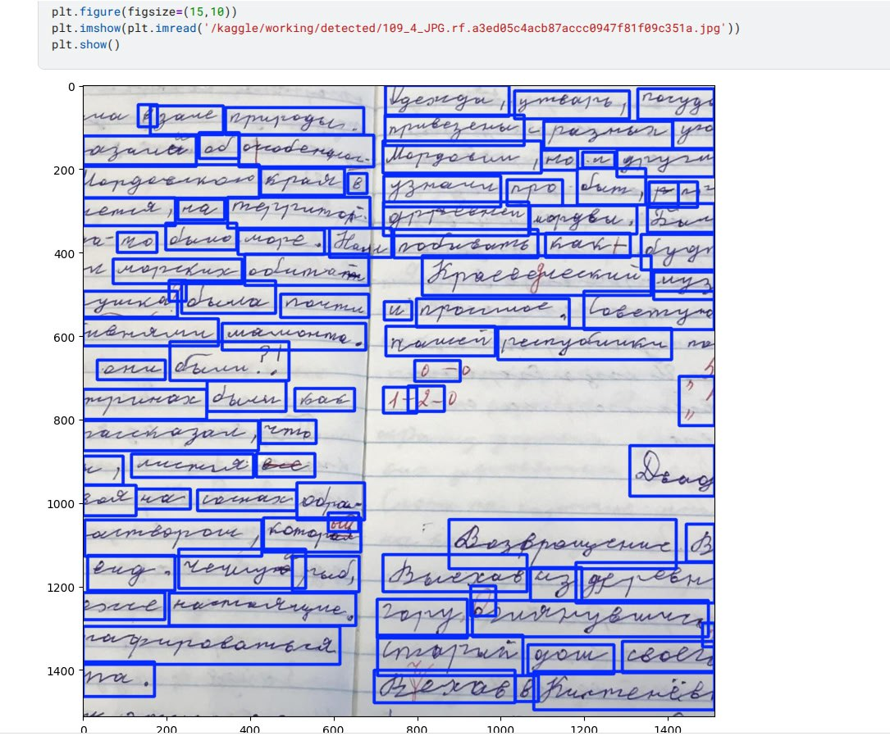
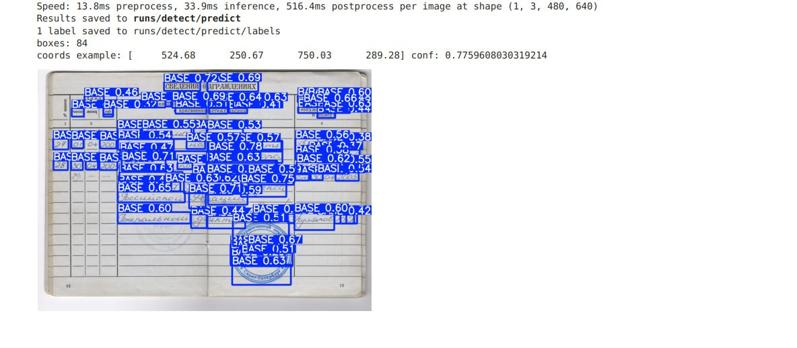

# Ресерч-док

## 1. Пример данных

Пример выходного JSON после обработки одного изображения:  
```json
[
  {
    "bbox": {
      "x": 512.0,
      "y": 341.25,
      "width": 1024.0,
      "height": 136.5
    },
    "text": "некоторый распознанный текст"
  },
  {
    "bbox": {
      "x": 512.0,
      "y": 341.25,
      "width": 1024.0,
      "height": 136.5
    },
    "text": "еще текст"
  }
]
```

## 2. Обзор датасетов

**Handwritten Russian Letters**

* ~145 000 изображений отдельных букв
*  аннотированные bbox + лейбл (буква)
* подходит для синтетической генерации слов и дообучения на кириллице

**Cyrillic Handwriting Dataset**

* реальные рукописные слова/фразы на кириллице
* несколько стилей почерка, шумы, искажения

**HWR 200**

* банковские анкеты с полями, заполненными от руки
* аннотации полей (даты, должности, названия организаций)

## 3. Метрики

* **CER**

CER = $(\frac{число подставленных, удаленных и пропущенных символов}{длина эталонной строки})$

* **WER**

WER = $(\frac{число замен, вставок, удалений слов}{количество слов в эталоне})$

## 4. Архитектура решения

1. Детекция текстовых блоков
    * Ultralytics YOLOv8s (быстро на CPU, ~100 ms на изображение)
    * настраивается под bbox полей анкеты
2. Распознавание текста 
    * CRNN + CTC
3. Дополнительные модули
   * Классификация типа документа (CNN-подход)
   * Детекция подписей/печатей (отдельная YOLO-модель)
   * Определение контекста (NER/глубокие эмбеддинги текста)





## 5. Пайплайн



## 6. Бэйслайн

Готова детекция, распознавание на подходе






